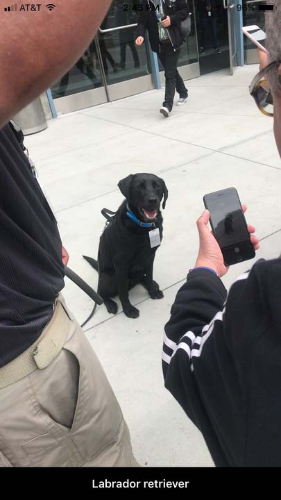

#  MachineLearningClassifier

`MachineLearningClassifier` is a demo application that uses iOS11's `CoreML` and `Vision` frameworks to do realtime object classificiation with the [Inception v3](https://github.com/tensorflow/models/tree/master/inception "Inception v3") model.

Example 🐶 classification from WWDC 17:

## Requirements
- Swift 4
- Xcode 9

